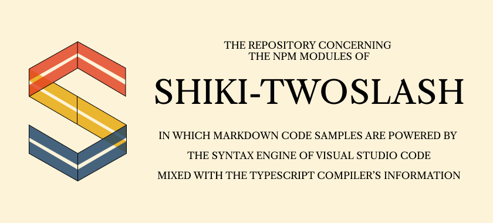

<center></center>

You take some Shiki, add a hint of TypeScript compiler, and 🎉 incredible statically generated code samples for describing code.

### This Repo

This repo uses **npm workspaces - you need `npm@7.7` or above**. There are three main areas:
 
 - `packages`, the shiki meets twoslash plugins for markdown renderers and static site generators
 - `site`, the docs micro-site
 - `examples`, example static site generator projects which use the plugins

The `site` and `examples` are excluded from the workspace. To work on those, `cd` to their folders and read instructions.

Otherwise:

```sh
git clone https://github.com/shiki/twoslash
cd twoslash

npm i
npm build
npm test
```

### TODO

- Finish design on microsite
- Website
- Docusaurus support is broken